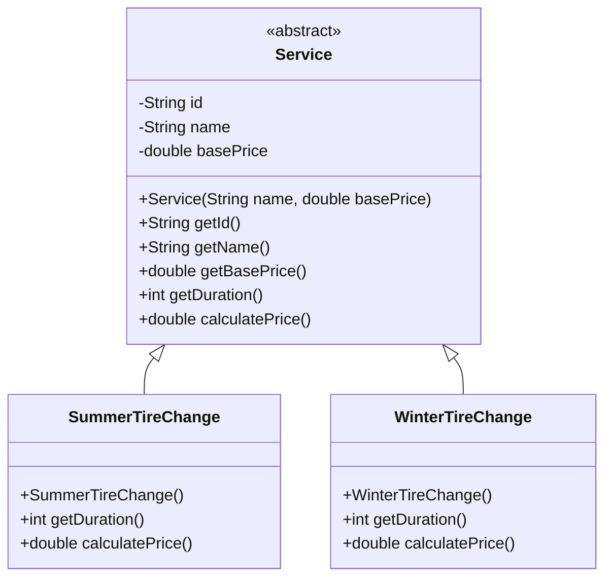

# Java OOP2 Concepts Exercises : Answers

## 🛠  How to Run :
1. Clone the Repository
    ```bash
    git clone https://github.com/jayani-athukorala/java-oop2-exercise.git
    ```
2. Open the project in preferred IDE.
3. Buld and Run ```Main.java```

---

## 📌 Exercise Document

You can find the exercise description here:

[Exercise Document](OOP2_Exercises.md)

---

## 🧱 UML Class Diagrams


---
## ⚡ Expected Output :

```
------------Exercise 1---------------
Service{ID='96b70816-15d1-46c3-b1f3-80061a0b8b57', Name='Summer Tire Change', BasePrice=80.0}, Service Duration='45', Total Price=72.0}
Service{ID='4193c7d8-9efc-4e35-bc2b-0c6d012e2582', Name='Winter Tire Change', BasePrice=100.0}, Service Duration='60min ', Total Price=120.0}


```

---