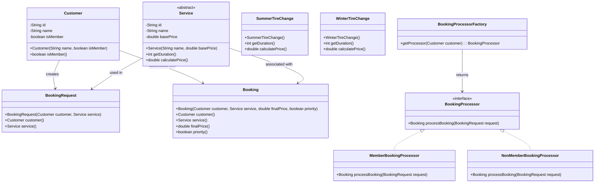

# Java OOP2 Concepts Exercises : Answers

## 🛠  How to Run :
1. Clone the Repository
    ```bash
    git clone https://github.com/jayani-athukorala/java-oop2-exercise.git
    ```
2. Open the project in preferred IDE.
3. Buld and Run ```Main.java```

---

## 📌 Exercise Document

You can find the exercise description here:

[Exercise Document](OOP2_Exercises.md)

---

## 🧱 UML Class Diagrams


---
## ⚡ Expected Output :

```
------------Exercise 1---------------
Service{ID = 'S-00', Name = 'Summer Tire Change', BasePrice = 80.0}, Service Duration = 45min, Total Price = 72.0
Service{ID = 'S-01', Name = 'Winter Tire Change', BasePrice = 100.0}, Service Duration = 60min, Total Price = 120.0
------------Exercise 2 ---------------
Service{ID = 'S-02', Name = 'Winter Tire Change', BasePrice = 100.0}, Service Duration = 60min, Total Price = 120.0
Service{ID = 'S-03', Name = 'Summer Tire Change', BasePrice = 80.0}, Service Duration = 45min, Total Price = 72.0
------------Exercise 3 ---------------
=== All Bookings ===
Booking{
	 ID = 'B-00'
	 Customer : Customer{ID = 'C-00', Name = 'John Smith', Is Member = true}
	 Service : Service{ID = 'S-04', Name = 'Summer Tire Change', BasePrice = 80.0}, Service Duration = 45min, Total Price = 72.0
	 Final Price : 61.2
	 Priority : true}
Booking{
	 ID = 'B-01'
	 Customer : Customer{ID = 'C-01', Name = 'Alice Johnson', Is Member = false}
	 Service : Service{ID = 'S-05', Name = 'Winter Tire Change', BasePrice = 100.0}, Service Duration = 60min, Total Price = 120.0
	 Final Price : 120.0
	 Priority : false}
Booking{
	 ID = 'B-02'
	 Customer : Customer{ID = 'C-02', Name = 'Bob Brown', Is Member = true}
	 Service : Service{ID = 'S-05', Name = 'Winter Tire Change', BasePrice = 100.0}, Service Duration = 60min, Total Price = 120.0
	 Final Price : 102.0
	 Priority : true}
Booking{
	 ID = 'B-03'
	 Customer : Customer{ID = 'C-03', Name = 'Emma Davis', Is Member = false}
	 Service : Service{ID = 'S-04', Name = 'Summer Tire Change', BasePrice = 80.0}, Service Duration = 45min, Total Price = 72.0
	 Final Price : 72.0
	 Priority : false}
Booking{
	 ID = 'B-04'
	 Customer : Customer{ID = 'C-04', Name = 'Liam Wilson', Is Member = true}
	 Service : Service{ID = 'S-04', Name = 'Summer Tire Change', BasePrice = 80.0}, Service Duration = 45min, Total Price = 72.0
	 Final Price : 61.2
	 Priority : true}
```

---